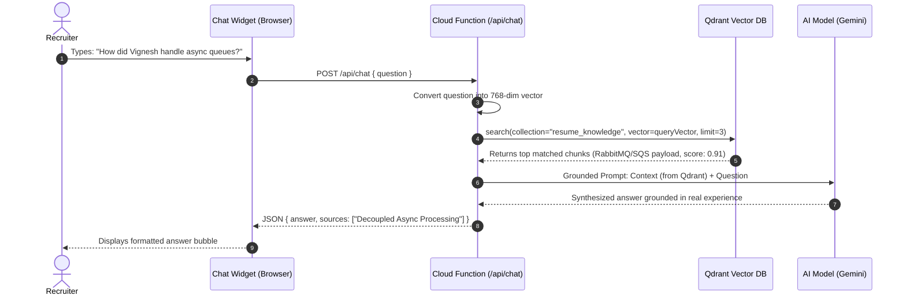

# Qdrant Vector Database - Complete Setup & Learning Guide

Welcome to the **Qdrant Vector Database** learning guide! This guide explains the core concepts of vector databases and provides instructions on running and querying Qdrant for the **AI Recruiter Assistant (RAG)** in your cloud resume project.

---

## 1. What is Qdrant?

**Qdrant** (pronounced *quadrant*) is an open-source, high-performance vector search engine and database written in Rust. It is built specifically to store, manage, and perform ultra-fast similarity searches over high-dimensional vector embeddings generated by machine learning models (like OpenAI, Gemini, Claude, or Hugging Face).

### Core Concepts to Understand:

| Concept | Explanation | Relational / SQL Analogy |
| :--- | :--- | :--- |
| **Collection** | A named set of points sharing the same vector dimension and distance metric. | A **Table** |
| **Point** | A single record containing an ID, a vector (array of floats), and an optional JSON payload. | A **Row** |
| **Vector** | High-dimensional array representing semantic meaning (e.g. 768 dimensions for Gemini `text-embedding-004`). | An indexed column |
| **Payload** | Arbitrary JSON metadata attached to a point (title, role, tags, markdown text). | Data columns |
| **Distance Metric** | The formula used to measure how similar two vectors are. We use **Cosine Similarity** (`Cosine`). | Search condition / WHERE |

---

## 2. Option A: Run Qdrant Locally via Docker (Recommended for Learning)

The easiest way to run Qdrant is with Docker. It starts in seconds and comes with a built-in web dashboard!

### Step 1: Start Qdrant Container
Run this command in your PowerShell or terminal:

```powershell
docker run -d -p 6333:6333 -p 6334:6334 --name qdrant-resume qdrant/qdrant
```

- Port `6333`: REST API & Web Dashboard
- Port `6334`: gRPC interface

### Step 2: Open the Qdrant Web Dashboard
Open your browser and visit:
👉 **[http://localhost:6333/dashboard](http://localhost:6333/dashboard)**

You will see Qdrant's interactive Web UI where you can view collections, inspect points, and run manual vector queries!

---

## 3. Option B: Use Free Qdrant Cloud (Managed)

If you prefer a cloud instance without running Docker locally:

1. Sign up for free at **[cloud.qdrant.io](https://cloud.qdrant.io)**.
2. Create a free 1GB cluster (100% free forever tier).
3. Copy your **Cluster URL** (e.g., `https://xxxxxx.us-east4-0.gcp.cloud.qdrant.io:6333`) and **API Key**.
4. Set them in your `functions/.env` file:
   ```bash
   QDRANT_URL=https://xxxxxx.us-east4-0.gcp.cloud.qdrant.io:6333
   QDRANT_API_KEY=your_api_key_here
   ```

---

## 4. Indexing Resume Knowledge into Qdrant (Seeding)

We have provided an automated ingestion script at `functions/scripts/seedQdrant.ts`.

It takes the 9 key areas of your resume:
1. Professional Summary & Profile
2. Technical Skills & Architecture Matrix
3. Tech Lead Experience at alfaTKG (JQMS, PTE, AlfaDock)
4. SDE Experience at alfaTKG
5. Software Engineer at Sirpi
6. Decoupled Asynchronous Processing (RabbitMQ / SQS / SignalR)
7. High-Availability Cloud Design (ALB / Multi-AZ RDS)
8. Firebase Serverless Hit Tracking Architecture
9. Tech Leadership & Upgrades (Qdrant, Terraform, Playwright)

### Run the Seeding Script:

```powershell
cd functions
npm install
npm run seed:qdrant
```

You will see:
```text
=====================================================
       QDRANT VECTOR DATABASE SEEDING PROCESS        
=====================================================
Connecting to Qdrant at: http://127.0.0.1:6333
[i] Creating collection "resume_knowledge" with 768-dim Cosine distance...
[✓] Created collection "resume_knowledge".
[i] Vectorizing 9 knowledge chunks...
[i] Upserting points into Qdrant collection...
[✓] Upsert finished with status: completed
-----------------------------------------------------
Qdrant Collection Status:
- Points Count: 9
- Vector Dimension: 768
- Distance Metric: Cosine
=====================================================
Seeding completed successfully!
```

---

## 5. How the RAG Pipeline Works in this Project

When a recruiter types a question in the AI Chatbot drawer (e.g., *"How did Vignesh handle asynchronous workloads at alfaTKG?"*):



This ensures that the AI answers accurately with real metrics and architectural decisions rather than generic hallucinated text!
